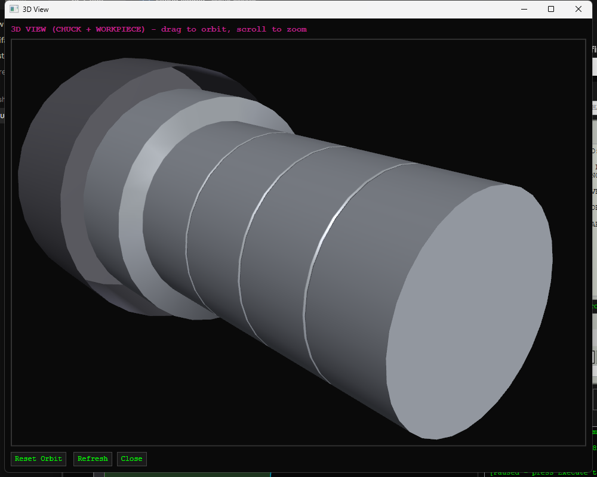
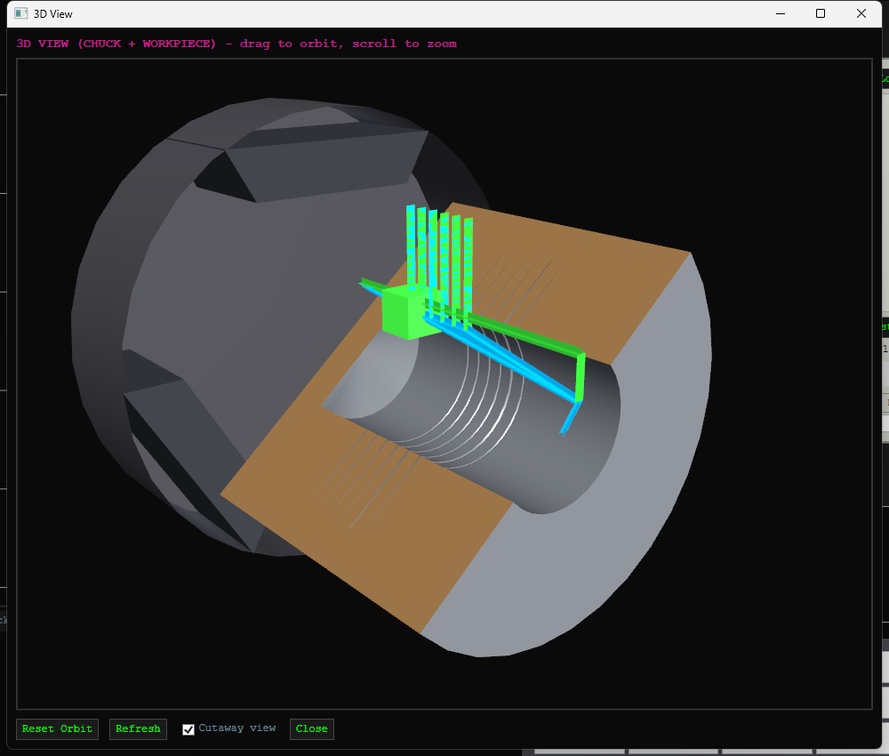
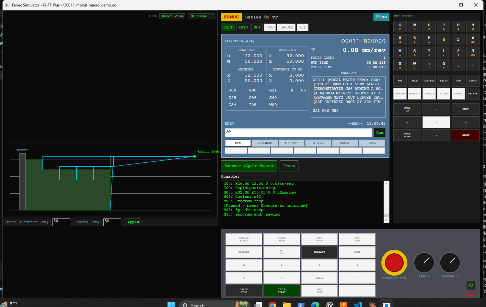
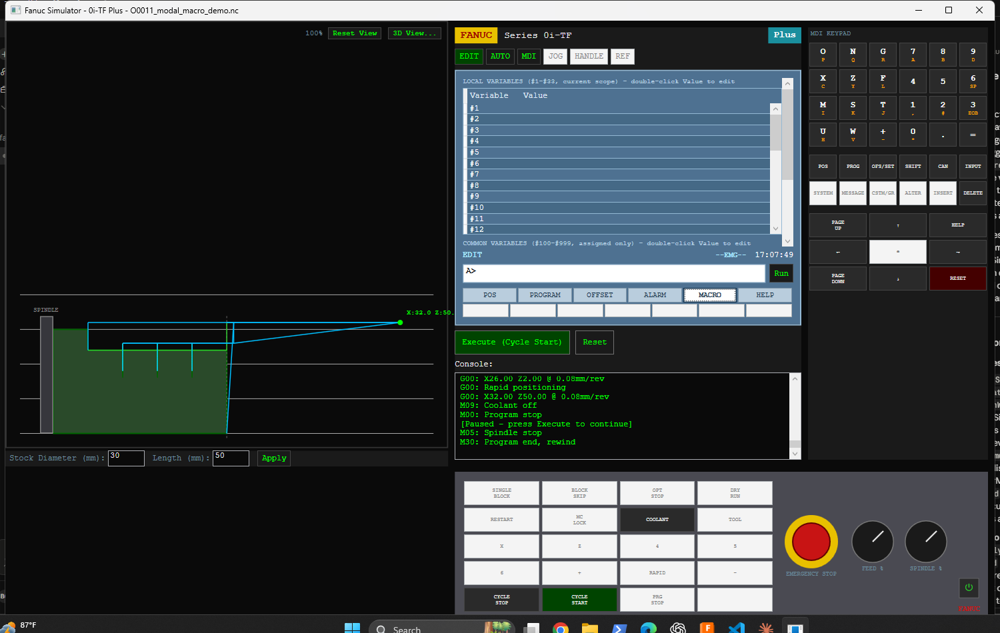
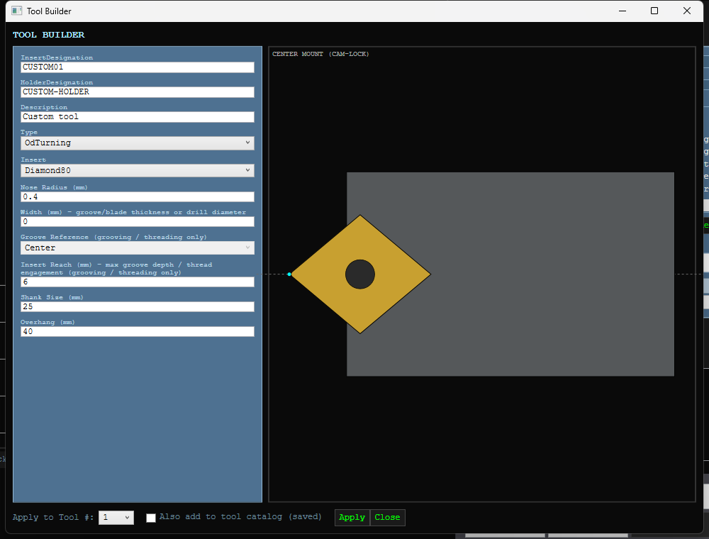

# FANUC 0i-TF Plus Lathe Simulator

[](https://github.com/Scitsy/CNC-Simulator/actions/workflows/ci.yml)

A CNC lathe simulator modeled on a real FANUC 0i-TF Plus control: a full G-code parser and
machining engine, a carved (not just drawn) stock model, and a WPF UI that mirrors the actual
control's screens (POS / PROGRAM / OFFSET / ALARM / MACRO / HELP), softkey navigation, and MDI
keypad. It's a hobby project, but it isn't a toy - canned cycles carve real geometry, cutter
compensation actually offsets the tool path, and Custom Macro B (FANUC's embedded macro language)
runs real conditionals and loops, not just token substitution.


## What it simulates

- **FANUC G-code system A**, the lathe default — absolute vs incremental is per-address (`X`/`Z` vs
  `U`/`W`), not a G90/G91 modal pair, and the control powers on in inch like the machine it's
  modelled on. Codes it doesn't support raise an alarm rather than being silently ignored.
- **Motion**: G00/G01/G02/G03 with real linear/arc interpolation, G20/G21 inch/metric, G96/G97
  constant surface speed vs. constant RPM (correct SFM and m/min formulae), G28 reference return.
- **Canned cycles**: the single cycles G90 OD/ID turning, G92 threading and G94 facing (modal, with
  taper), plus the multiple repetitive cycles G70 finishing, G71/G72 rough turning/facing, G74 peck
  drilling, G75 grooving (external and internal/ID), G76 threading (multi-pass, equal cutting area,
  spring passes), G32/G33 single-block threading, and G80 to cancel.
- **Cutter nose radius compensation**: G41/G42/G40 - a true perpendicular-to-travel offset with
  corner mitering, not a cosmetic flag.
- **Work and tool offsets**: G54-G59 work coordinate systems, a full tool offset table (geometry +
  wear, X/Z), all editable live on the OFFSET screen.
- **A visual tool library**: a schematic tool-geometry renderer plus a Tool Builder window for
  designing custom holder/insert combinations.
- **Custom Macro B**: local (`#1-#33`) and common (`#100-#999`) variables, arithmetic expressions,
  `IF/GOTO`, `WHILE/DO/END`, `G65`/`G66`/`G67` macro calls, and a handful of read-only system
  variables (`#4001` active motion mode, `#5001`/`#5002` current X/Z). See
  [docs/custom-macro-b.md](docs/custom-macro-b.md) for how this actually works, including a couple
  of real bugs it took to get here.
- **Program management**: `FOLDER`/`OPRT` softkey-stack navigation and BG-EDIT split-screen
  background editing, matching the real control's workflow for juggling multiple resident programs.
- **A carved stock model**: the workpiece is a sampled profile that actually loses material as the
  program runs (turning, facing, boring, drilling, grooving, threading all modify it), not a static
  outline with a toolpath drawn over it.
- **Realistic cycle-time simulation**: RUN TIME/CYCLE TIME on the POS ALL screen are computed from
  actual commanded physics (feed rate + distance, true arc length for G02/G03, G04 dwell duration,
  a rapid-traverse default) as the program runs, not wall-clock time - a program that would take two
  minutes on a real machine reports about two minutes, even though the simulator itself executes
  instantly.
- **A 3D view**: the same carved stock revolved into a shaded 3D solid alongside a 3-jaw chuck
  stand-in, the current tool position, and the toolpath itself (color-coded rapid/feed, matching the
  2D canvas) - its own window with mouse-drag orbit, scroll-to-zoom, and a cutaway mode that always
  cuts away whichever side currently faces the camera, so internal bores/grooves are visible from
  any angle. A first pass, not a full machine model (see Scope below).

| | |
|---|---|
|  |  |

## Screenshots

| | |
|---|---|
|  |  |
|  |  |

The lathe canvas supports scroll-to-zoom (centered on the cursor) and drag-to-pan for inspecting
one carved feature closely, with a "Reset View" button (or double-click) to snap back to the
default auto-fit framing.

## Getting started

Requires the .NET 8 SDK on Windows (the UI is WPF).

```bash
git clone https://github.com/Scitsy/CNC-Simulator.git
cd CNC-Simulator
dotnet run --project FanucSimulator.csproj
```

Or open `FanucSimulator.sln` in Visual Studio / Rider and run the `FanucSimulator` project.

## Try it: demo programs

`NCFiles/` has over a dozen example programs, loadable from the PROGRAM screen's `Load...` button.
A few worth starting with:

- **`O0014_inch_turning_demo.nc`** - the closest to real shop work: inch throughout, faced with the
  `G94` cycle, roughed with a modal `G90` (bare `X` blocks taking successive passes), finished using
  `U`/`W` incremental addressing, and grooved with `G75`. Runs on the default 3.0 x 4.0 in stock.
- **`O0011_modal_macro_demo.nc`** - the best showcase of the macro engine: `G66`/`G67` arm and
  cancel a modal macro call that auto-fires before each positioning move, cutting three witness
  grooves without a `G65` on every line. Set stock to 30mm OD x 50mm length before running.
- **`O0009_macro_groove_pattern.nc`** - a `WHILE` loop driving a repeated groove pattern.
- **`O0013_g74_and_system_vars_demo.nc`** - peck-drills a bore with the new `G74` cycle, then reads
  the result back through `#5001`/`#5002`/`#4001` into common variables you can watch update live
  on the MACRO screen.
- **`O0008_pipe_fitting_npt.nc`** - an NPT-threaded pipe fitting, showing the threading cycle and
  work offsets together on a more realistic part.
- **`O0007_full_stress_test.nc`** - exercises most of the engine's features in one program.

## Testing

`EngineTest/` is a headless console harness (source-linked against the same engine files, no test
framework dependency) with 228 hand-rolled assertions covering every documented G/M-code, both
canned-cycle directions, macro control flow, geometry checks against several of the demo programs
above, the catalog-persistence round-trip, and exact closed-form cycle-time checks. Runs
automatically on every push via GitHub Actions (see the badge at the top of this file).

```bash
cd EngineTest
dotnet run
```

## Project layout

- `GCodeParser.cs` - tokenizes and parses G-code blocks.
- `LatheSimulator.cs` / `.CannedCycles.cs` / `.Macro.cs` - the engine: motion dispatch, canned
  cycles, and Custom Macro B, respectively.
- `StockProfile.cs` - the carved stock model.
- `OffsetTables.cs` / `ToolCatalog.cs` / `ToolGeometryRenderer.cs` - tool/work offsets and the
  visual tool library.
- `MainWindow.xaml(.cs)` / `ToolBuilderWindow.xaml(.cs)` / `Stock3DWindow.xaml(.cs)` - the UI.
- `NCFiles/` - demo programs. `EngineTest/` - the regression suite.

## Scope

This models a 2-axis turning center closely enough to be useful for learning and testing programs,
not a certified twin of any real control. Not currently modeled: Custom Macro B indirect addressing
(`#[expr]`) and multiple statements per block, and general system variables beyond the three listed
above. The 3D view is a first pass: the chuck is a simplified 3-jaw stand-in (flat wedge jaws, not
manufacturer-accurate geometry), the cutaway view only ever cuts the workpiece (not the chuck), and
a through-bore right at the face isn't specially mitered against the end cap.

## License

[MIT](LICENSE)
